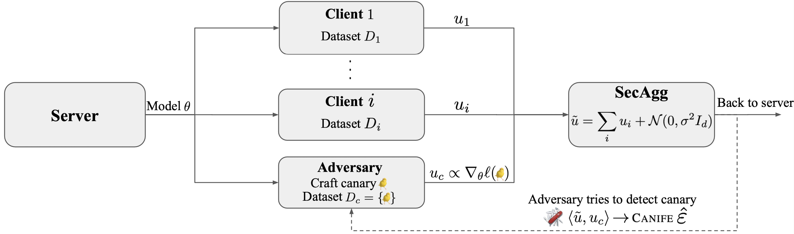
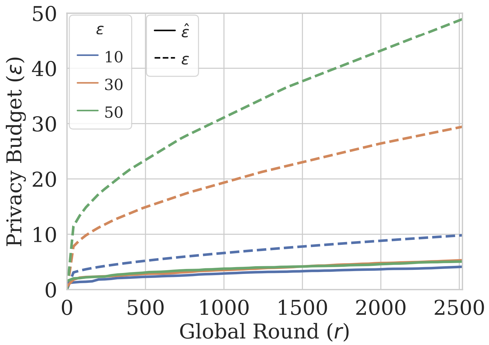

# CANIFE: Crafting Canaries for Empirical Privacy Measurement in Federated Learning

<p align="center">
  
</p>

This repository contains code for the paper ["CANIFE: Crafting Canaries for Empirical Privacy Measurement in Federated Learning"](https://arxiv.org/abs/2210.02912). We implement an attack to measure the empirical privacy of federated training pipelines based on designing out-of-distribution examples which we call *canaries*. 

Our implementation is based on a modified [FLSim](https://github.com/facebookresearch/FLSim) but the code contained within `canife` can be used in any (PyTorch-based) FL framework of your choice.

## Installation

Via pip and anaconda

```
conda create -n "canife" python=3.9 
conda activate canife
pip install -r ./requirements.txt
```

## Paper Replication

<p align="center">
  
</p>

### CelebA
To replicate the above plot on CelebA with epsilon=50 first clone the [LEAF](https://github.com/TalwalkarLab/leaf/tree/master/data/celeba) repo and then under `../leaf/data/celeba/` run

```
./preprocess.sh -s niid --sf 1.0 -k 0 -t user
```

This should form splits `all_data_0_0_keep_0_train_9.json` and `all_data_0_0_keep_0_test_9.json` under `../leaf/data/celeba/train/` and `..leaf/data/celeba/test/` respectively.

To begin training with periodic attacking run the command:

<!-- ``` sent140
python launcher.py --dataset sent140 --dump-path DUMP_PATH --data-root DATA_ROOT --epsilon 50 --canary-setup holdout --canary-test-type train_freeze --canary-loss loss2 --canary-design-pool-size 800 --canary-design-minibatch-size num_users --canary-num-test-batches 100 --canary-insert-offset 100 --users-per-round 100 --local-batch-size 32 --canary-epochs 2000 --fl-epochs 15 --model-arch lstm --canary-norm-matching True --canary-norm-constant 5 --device cpu
``` -->

<!-- ``` shakespeare
python launcher.py --dataset shakespeare --dump-path DUMP_PATH --data-root DATA_ROOT --epsilon 50 --canary-setup holdout --canary-test-type train_freeze --canary-loss loss2 --canary-design-pool-size 100 --canary-design-minibatch-size num_users --canary-num-test-batches 100 --canary-insert-offset 8 --users-per-round 60 --local-batch-size 128 --canary-epochs 2000 --fl-epochs 30 --model-arch shakes-lstm --canary-norm-matching True --canary-norm-constant 5 --device cpu --fl-client-lr 3
``` -->

``` 
python launcher.py --dataset celeba --dump-path DUMP_PATH --data-root DATA_ROOT --epsilon 50 --canary-setup holdout --canary-test-type train_freeze --canary-loss loss2 --canary-design-pool-size 100 --canary-design-minibatch-size num_users --canary-num-test-batches 100 --canary-insert-offset 40 --users-per-round 100 --local-batch-size 128 --canary-epochs 2000 --fl-epochs 30 --model-arch resnet --canary-norm-matching True --canary-norm-constant 5 --device cpu
```

Where:
* `DATA_ROOT` is the path to the CelebA LEAF data folder i.e `.../leaf/data/celeba` 
* `DUMP_PATH` is the path for CANIFE to output experiment training plots and logs which by default is `./local_checkpoints`

One can also set `--plot-path PLOT_PATH` to output to `DUMP_PATH/PLOT_PATH/` (by default `plot_path=""`). Change `--device cpu` to `--device gpu` to run on a single GPU.

> **NOTE:** `./local_checkpoints/` has a toy example attack output (from a checkpointed DP model on Sent140) which should be deleted before running any new experiments. Alternatively, change the `--plot-path` arg to a new folder within `./local_checkpoints/`.

Once the experiment has been completed you can extract the data and plot as follows:
* Extract attack logs from attack checkpoints (`.tar` files) by running the script `python extract_exp.py --path DUMP_PATH/ --csv-name celeba_eps50_tf.csv`
* Plot the attack using the script `python plot_sweep.py --csv-path PATH_TO_CSV/celeba_eps50_tf.csv`

This will output the figure under `/plotting/`

> **NOTE:** To generate the full figure, rerun the experiment with `--epsilon` equal to 10 and 30 with different `--plot-path` args, extract each `.csv` and combine them before plotting.
### Other Datasets
For other LEAF datasets make the following changes:

* Ensure you have the correct splits under `leaf/data` see the LEAF repo for installation [instructions](https://github.com/TalwalkarLab/leaf)
  <!-- * For CelebA: 
    * Use LEAF preprocess cmd: `./preprocess.sh -s niid --sf 1.0 -k 1 -t user` in `..leaf/data/celeba/`
    * Will form splits `all_data_0_0_keep_0_train_9.json` and `all_data_0_0_keep_0_test_9.json` -->
  * For Shakespeare:
    * Use LEAF preprocess cmd: `./preprocess.sh -s niid --sf 1.0 -k 0 -t sample -tf 0.8` in `..leaf/data/shakespeare/`
    * Will form splits `all_data_0_0_keep_0_train_9.json` and `all_data_0_0_keep_0_test_9.json`
  * For Sent140:
    * Use LEAF preprocess cmd: `./preprocess.sh -s niid --sf 1.0 -k 0 -t user` in `../leaf/data/sent140/`
    * Will form splits `all_data_0_15_keep_1_train_6.json` and `all_data_0_15_keep_1_test_6.json`

* For running Shakespeare:
  * Add/replace args `--model-arch shakes-lstm --dataset shakespeare --users-per-round 60 --fl-epochs 30 --fl-client-lr 3 --local-batch-size 128 --canary-insert-offset 8 --canary-design-pool-size 100`
* For running Sent140:
  * Add/replace args `--model-arch lstm --dataset sent140 --users-per-round 100 --fl-epochs 15 --local-batch-size 32 --canary-insert-offset 100 --canary-design-pool-size 800`
<!-- * For CelebA:
  * Add/replace args `--model-arch resnet --dataset celeba --fl-epochs 30 --canary-insert-offset 40 --canary-design-pool-size 500` -->

## Reference

If the code and/or paper contained in this repository were useful to you please consider citing this [work](https://arxiv.org/abs/2210.02912):
```
@article{maddock2022canife,
  title={{CANIFE}: Crafting Canaries for Empirical Privacy Measurement in Federated Learning},
  author={Maddock, Samuel and Sablayrolles, Alexandre and Stock, Pierre},
  journal={arXiv preprint arXiv:2210.02912},
  year={2022}
}
```

## Contributing
See the [CONTRIBUTING](https://github.com/facebookresearch/canife/blob/main/CONTRIBUTING.md) for how to contribute to this library.


## License
This code is released under BSD-3-Clause, as found in the [LICENSE](https://github.com/facebookresearch/canife/blob/main/LICENSE) file.
